# **Active Directory Monitoring on Splunk Homelab**

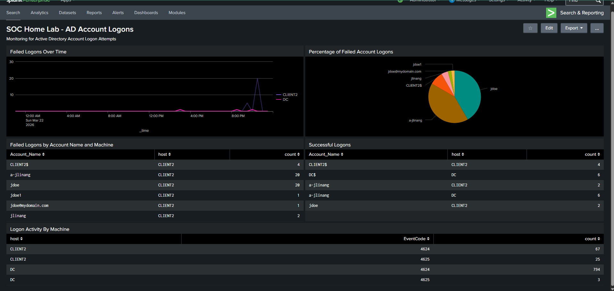

## 1. Project Overview

The purpose of this lab is to integrate a Splunk environment into my existing Active Directory home lab. 
**Update:** Added new Part which includes creating an alert in Splunk for detecting potential brute force attacks. Also includes link to incident report. 

<details>
<summary> More about the AD Lab </summary>

To create the Active Directory set up, I followed Josh Madakor's walkthrough.
[Josh Madakor's video](https://www.youtube.com/watch?v=MHsI8hJmggI&t=1675s)

On top of his videos, I created automation scripts to handle the user creation and user deletion of over 200 users for Active Directory.
[Read More Here](https://github.com/jocoli/BasicPowerShellScripts-JoshuaLinang/tree/master)

</details>

With Splunk I will be able to monitor logs from the Active Directory and machines connected to it. I will be able to see events like failed or successful logons, later I will create a PowerShell script which I will use to generate logs on Splunk that will look like a brute force attack. I hope you enjoy the read.

## Prerequisites
- VirtualBox installed
- Active Directory lab already configured
- Splunk Enterprise Account (free trial works)

## 2. Network Topology/Architecture

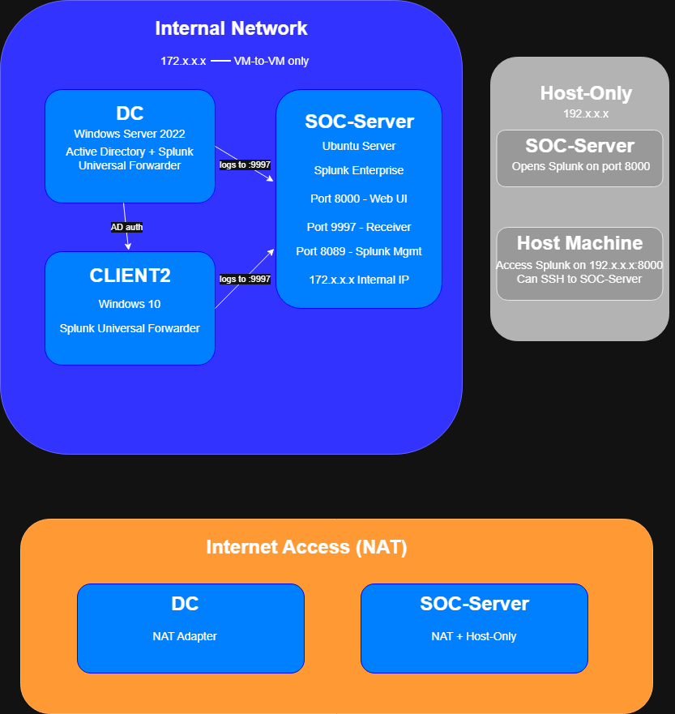

In this lab we have 3 Virtual Machines. Their networks are configured differently.

1. Domain Controller (DC) - This virtual machine hosts our Active Directory. It utilizes NAT for Internet Access and Internal Network to connect with other VMs in that same network.
2. Client (CLIENT2) - This virtual machine is the machine domain users would log into. For now in this lab they only need to be on Internal Network since they aren't required to use the Internet.
3. SOC-Server - This virtual machine hosts our Splunk instance, and possible other security tools in the future. It requires Internal Network to communicate with the VMs and NAT to connect to the Internet. I also gave it Host-Only network so it can communicate with the host machine, and so I can ssh into the VM from my host machine. 

## 3. Technologies Used

Here is a list of technologies used in this project.

* VirtualBox
* Windows Server 2022
* Windows 10
* Ubuntu Server
* Splunk Enterprise
* Splunk Universal Forwarder
* Active Directory

## 4. Lab Set Up

In this section we will talk about the lab set up. We will start from the process of creating the SOC-Server. For the Active Directory lab and the creation of DC and CLIENT2, click on the following.

<details>
<summary> More about the AD Lab </summary>

To create the Active Directory set up, I followed Josh Madakor's walkthrough.
[Josh Madakor's video](https://www.youtube.com/watch?v=MHsI8hJmggI&t=1675s)

On top of his videos, I created automation scripts to handle the user creation and user deletion of over 200 users for Active Directory.
[Read More Here](https://github.com/jocoli/BasicPowerShellScripts-JoshuaLinang/tree/master)

</details>

**Step 1: Creating the VM, and Configuring it** 

First we begin by installing the Ubuntu Server.
[Ubuntu Server Link](https://ubuntu.com/download/server#how-to-install-tab-lts)

Then we create a new virtual machine called SOC-Server on Virtual Box and ensure we give it the following specs.
- 4gbs of RAM
- 50 gbs of storage
- atleast 2 CPU cores
- Networks - Internal Network, NAT, Host-Only

Now we have to ensure we can connect to the DC.
If you use ip a on the SOC-Server you should see 3 instances (example: enp0s1, enp0s9). Make sure it lists the Internal Network IP and Host-Only IP. Use ipconfig on the DC VM and ip a on SOC-Server to ensure the IP addresses match. Then from the SOC-Server, ping the DC VM's IP address, if we were able to ping its IP then we may proceed. 

**Step 2 Downloading and Starting Splunk**

Now we can move on to download Splunk. *Note:* Splunk Enterprise is required but you can use a free trial that lasts 60 days. 

You can download splunk using wget, I recommend using SSH from the host to copy and paste the wget command into the VM, otherwise you may need to type the command in manually.

After installing Splunk on SOC-Server and extracting it, we create a splunk user so that they may access splunk. We do this because starting Splunk from the root is being deprecated and it is better to access it away from root, just in case of compromise making it good practice. 

```bash
sudo useradd -r -m -d /opt/splunk -s /bin/bash splunk
```

- useradd: Create a new user
- -r: Make it a "system user" (for services, not human login)
- -m: Create a home directory
- -d /opt/splunk: Set home directory to /opt/splunk (where Splunk is installed)
- -s /bin/bash: Set shell to bash (so you can switch to this user if needed)
- splunk: The username

Then we give ownership to the new user.

```bash
sudo chown -R splunk:splunk /opt/splunk
```
Now we can finally start the Splunk Instance

```bash
sudo -u splunk /opt/splunk/bin/splunk start --accept-license
```

This will start the instance on Port 8000, which you can access on the Host machine using the 192.x.x.x:8000 on the browser. Now you should be able to access Splunk! Right now we won't have any logs to look through so lets go into the Domain Controller and Client VM's to send their logs to Splunk using the Splunk Universal Forwarder. But before that ensure that in the web instance for Splunk go to its setting and ensure that the receiving port is set to 172.x.x.x:9997. This is where we will send the logs to.

**Step 3: Forwarding Logs to Splunk**

We will download Splunk Universal Forwarder from the Domain Controller with the admin account. *Note:* We will use this admin account again for the Client VM to get the Splunk Universal Forwarder download since the Client VM doesn't have access to the Internet. 

After downloading the Splunk Universal Forwarder, make sure on-premises Splunk instance is selected and that set the Receiving Indexer to 172.x.x.x:9997. You can skip the Deployment server section as we are not using that for this lab. You may need to create credentials but you can create a simple one. 

After finishing the installation wizard, we can confirm its installation by running PowerShell as an administrator and running:

```powershell
Get-Service SplunkForwarder
```

It should list the instance as Running.
Now we must configure the logs to forward to Splunk.

```powershell
notepad "C:\Program Files\SplunkUniversalForwarder\etc\system\local\inputs.conf"
```

You may be prompted to create a new file if it does not exist, create a new one and paste the following:

```ini
[WinEventLog://Security]
index = main
disabled = false

[WinEventLog://System]
index = main
disabled = false

[WinEventLog://Application]
index = main
disabled = false
```

Save it and check outputs.conf if it has your receiving port there (172.x.x.x:9997) then restart the forwarder.

Now we should be able to see logs from the DC in Splunk. If you go on the Splunk web instance at port 8000, and in the search bar you enter **index = main** we can finally see some logs!

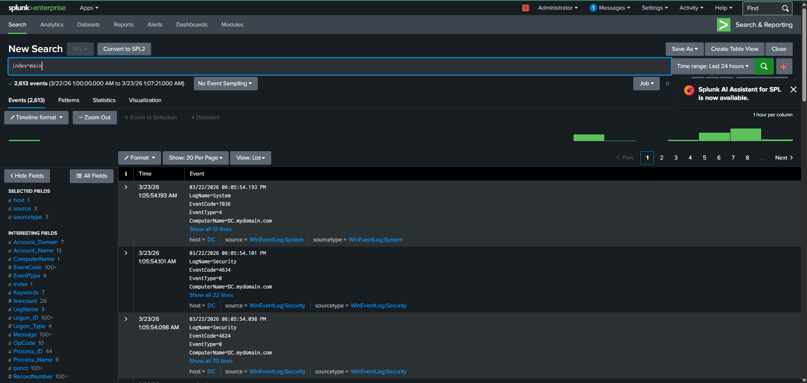

Now we will do the exact same thing for the Client machine. However if you don't have internet access on the Client machine, you must access the file using the File Explorer and entering: \\DC\C$\Users\(your admin account)\Downloads

There you will find the installation wizard and you can repeat the same process for the Client.

After setting up the Splunk Forwarder for the client you will be able to see its logs on Splunk.

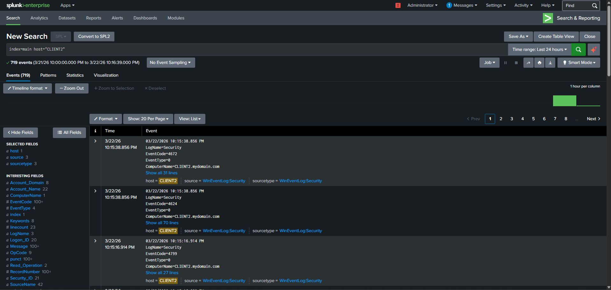

Now we have both forwarders set up for the DC and Client VMs!

**Step 4: Creating a Brute Force Simulation**

Now let's create a script to simulate how a brute force attack would look like on Splunk.

On the Client VM, we will create a PowerShell Script called bruteforce.ps1. You can do this in PowerShell ISE.

```powershell
$domain = "mydomain.com"
$username = "a-jlinang"
$wrongPassword = "WrongPassword123"

1..20 | ForEach-Object {
    $credential = New-Object System.Management.Automation.PSCredential(
        "$domain\$username",
        (ConvertTo-SecureString $wrongPassword -AsPlainText -Force)
    )
    try {
        Start-Process -FilePath "cmd.exe" -Credential $credential -ErrorAction Stop
    } catch {
        Write-Host "Attempt $_ failed - as expected"
    }
    Start-Sleep -Seconds 1
}
```

In this script, the target (a-jlinang, my admin account), will attacked using WrongPassword123 ensuring each attempt failing. The account will be attacked 20 times with a 1 second pause between each attempt. Here is the script being run, note you may need to change the execution policy as it may prevent you from running the script.

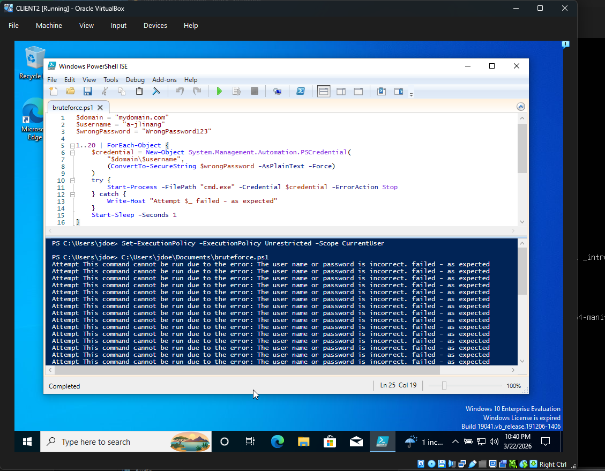

Now that we ran the script lets look at what shows up at the Splunk instance!

**Step 5: Monitoring on Splunk**

On Splunk we will change the search query to filter the logs we want to see. For this lab we will focus on two specific event codes:

1. EventCode=4624

This event code is for logs indicating successful logons. Meaning a user was able to successfully log on to their account.

2. EventCode=4625

This event code is for logs indicating failed logons. Meaning a user attempted to log into an account but failed. Thanks to our script we are expecting to see a quick burst of 20 failed log in attempts. This .gif will show going through logs of failed log in attempts.


By entering the eventCode = 4625, we can see numerous logs of failed log in attempts.


This is how successful logons will look like:
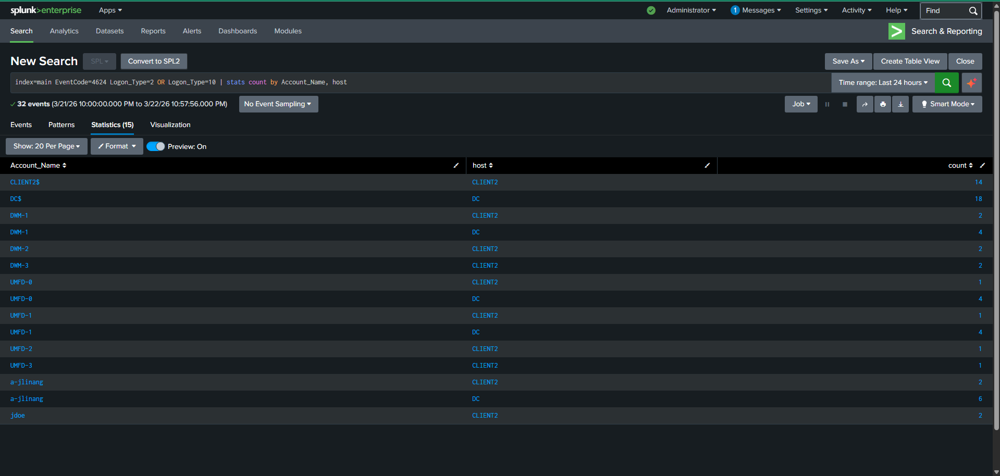

To make it visually better by removing some of the non-user accounts we can enter the following:
```splunk
index=main EventCode=4624 Logon_Type=2 OR Logon_Type=10 NOT (Account_Name="DWM*" OR Account_Name="UMFD*") | stats count by Account_Name, host
```

To get an overview of failed logons we can apply this search query:
```splunk
index=main EventCode=4625 | stats count by Account_Name, host
```
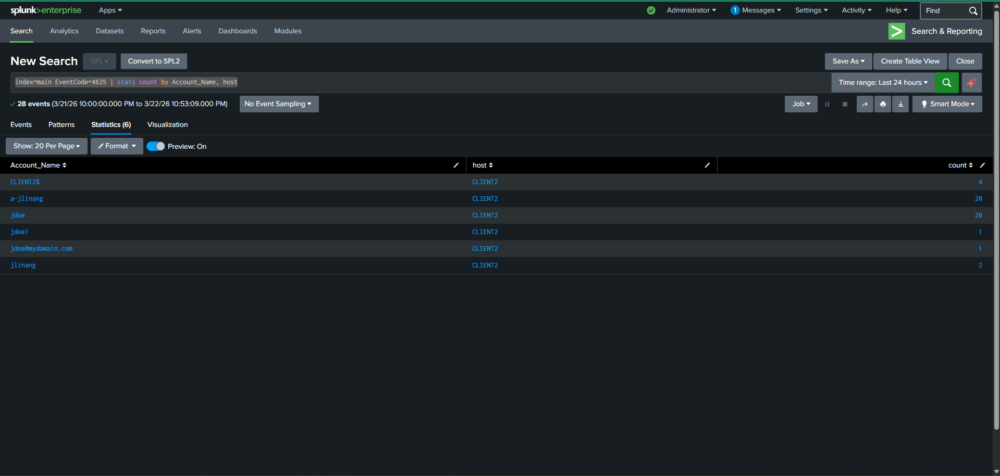

We see the number of times that a user was involved in logs with failed log in events. Both jdoe and a-jlinang have a count of 20 since they are both included in those event logs with jdoe being the source and a-jlinang being the target.

With search queries like these we can investigate and monitor for potential anomalies.

Now let's create a dashboard for Active Directory Logons.

We will use the following search queries for this:

**Failed Log ins (brute force)**
```splunk
index=main EventCode=4625 | stats count by Account_Name, host
```

**Time of Failed Logons**
```splunk
index=main EventCode=4625 | timechart count by host
```

**Percentage of Failed Logons**
```splunk
index=main EventCode=4625 | top limit=10 Account_Name
```

**Successful Logons**
```splunk
index=main EventCode=4624 Logon_Type=2 OR Logon_Type=10 NOT (Account_Name="DWM*" OR Account_Name="UMFD*") | stats count by Account_Name, host
```

**Logon Activity by Machine (Successful and Failed Events)**
```splunk
index=main EventCode=4624 OR EventCode=4625 | stats count by host, EventCode
```

Adding these to our dashboard and creating different visualizations for some of the panels we can create a dashboard that looks like this!


## 5. Creating a Splunk Alert

I created an alert in Splunk to expand my lab to be more what it would be like in a SOC operation. Here is the alert:

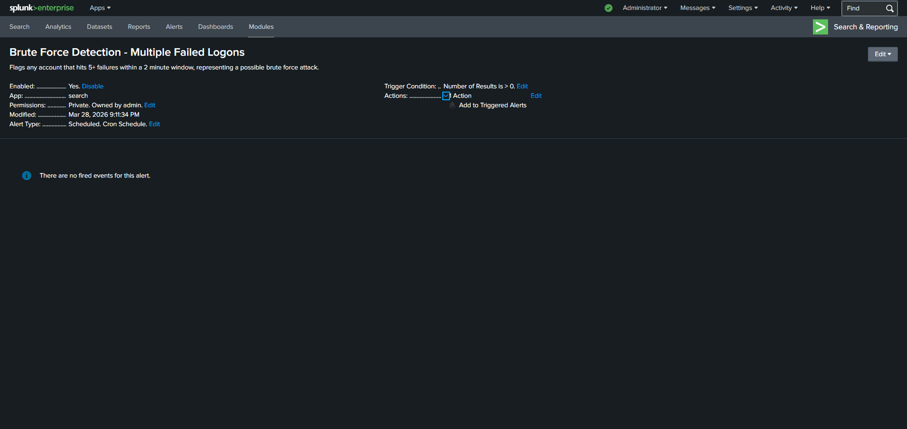

I wanted to create an alert to build on top of my project, so I decided to base it around what I already have, a brute force simulation.
This is the SPL query used to create the alert:

```splunk
index=main EventCode=4625 | bucket _time span=2m | stats count by _time, Account_Name, host | where count >= 5
```

This query searches for failed logon events in the span of two minutes if there were more than 5 events. 

In the alert you can also view the settings and configurations. It runs on a Cron schedule every 5 minutes and its time range is 5 minutes. The alert is triggered when the query runs and at least one result is found. It is then added to triggered alerts. 

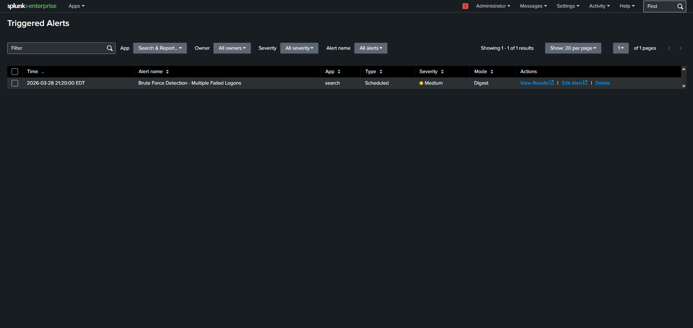

We can also view the triggered alert which automatically inputs the search query and the time the incident occurred.

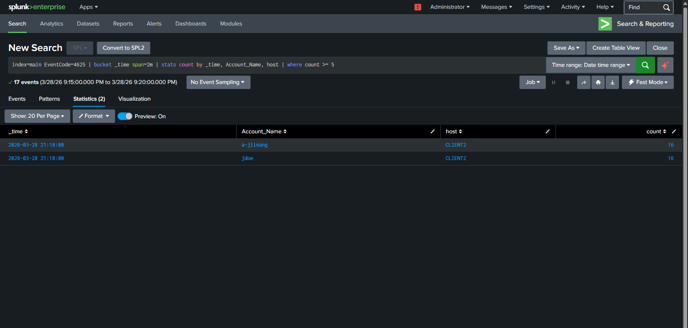

In the image you can see we have two results, and we focus on the event time, account names involved, the specific host machines involved, and the number of logs associated with that event.

## 6. Incident Report

After creating an alert and confirming that it works, I then proceeded to create an incident report to best follow how SOC Analysts would act in a similar scenario.
For now, I decided to take the role of a Level 1 SOC Analyst reporting to their manager or escalating to Level 2 SOC Analysts. The incident report starts with the alert that was triggered, which was on 3/28/26 around 9:18 PM. We would then investigate this alert by analyzing the logs associated with it. We want to look specifically for the "a-jlinang" account since it is the domain admin account and realistically holds the most risk if compromised.

```splunk
index=main EventCode=4625 Account_Name="a-jlinang" | bucket _time span=2m
```
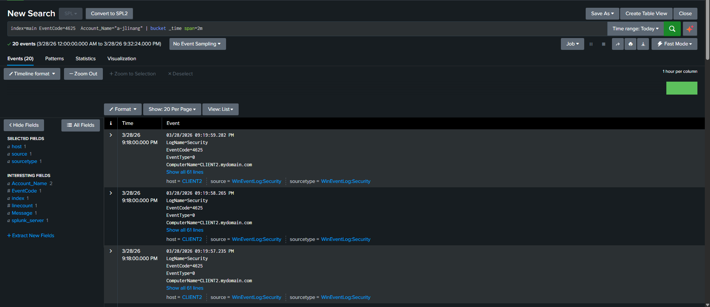

That gives us logs that we can examine, since we are working with a scripted "brute force attack," most of/if not all of these logs are identical. The following images shows us important information associated with these logs such as: the account name (which is the domain admin account, but also the other account involved "jdoe"), the host machine involved (CLIENT2), and the reason for failure.

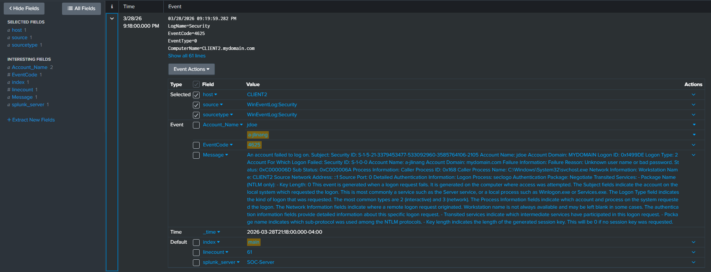

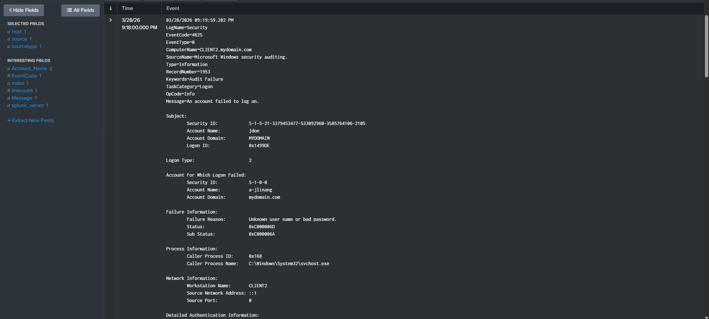

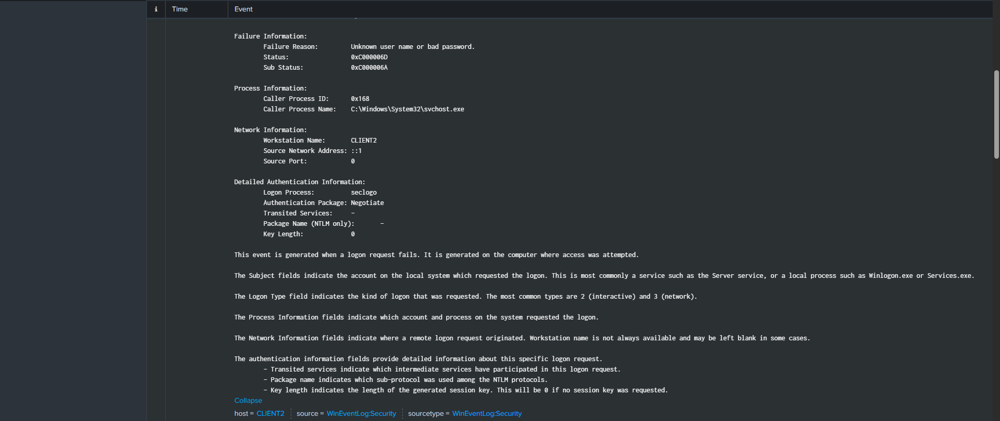

We can see that the "attacker" tried to log onto the domain admin account from the "jdoe" account who was on the CLIENT2 host machine at that time. However, the alert or the logs does not indicate that they were successful. Since we are specifically looking for a large number of failed logon activity that would indicate a potential brute force attack, we must also not forget to confirm that the attacker was or was not able to successfully log on.

To this we know must look at the logs for successful logons regarding the domain admin account "a-jlinang."

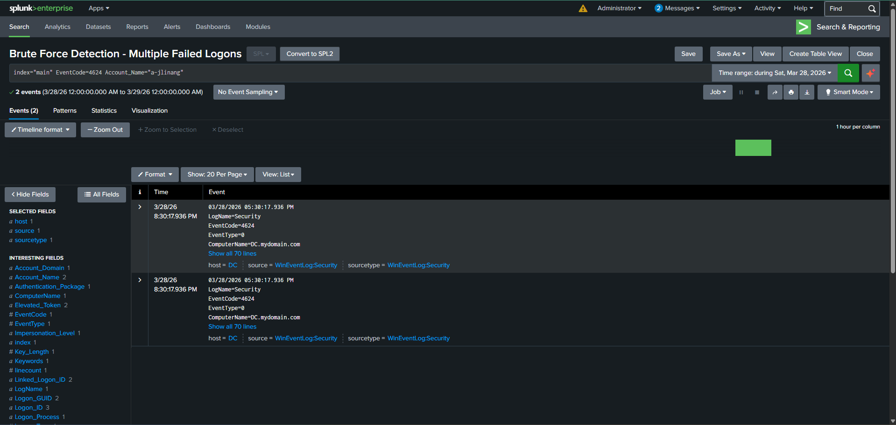

Here we see that there were successful logons to the "a-jlinang" account, but we must may close attention to the time. These events were around 8:30 PM, but the alert was triggered around 9:18 PM. So these events may not be related to the incident and may be normal behavior. To be even more sure, we could expand our search query to specifically target logons to the domain admin account from the CLIENT2 machine that the attacker was on. This is because if the attacker was successful, then we would see that the logon to "a-jlinang" but on the CLIENT2 host instead of the normal DC host since the attacker does not have access to that machine.

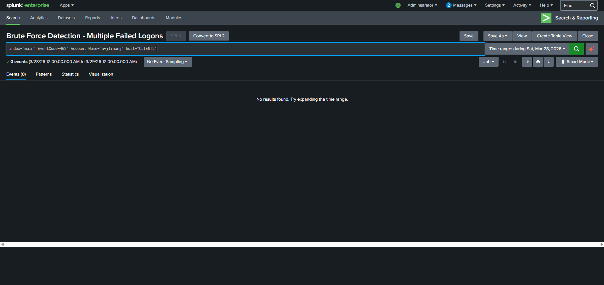

Putting in that factor we can see that there were no results found that included successful logons from the CLIENT2 host. This means that the attacker was not successful in logging onto the domain admin account. If the attacker was successful then the severity of this incident would be **High** since having access to the domain admin account could cause much more damage to the organization. With the domain admin account, the attacker can ensure that they have access to our system and potentially cause massive damage or steal confidential data. However, since the attacker was unsuccessful the severity of the incident is more suited to a **Medium**, this is because they while they may not cause the same damage, they can cause still cause trouble especially from an employee account "jdoe." If "jdoe" belonged to a department who are working on a specific project, the attacker may have access to that project as well.

Possible remediations for this incident includes, temporarily disabling the "jdoe" account, quarantining the CLIENT2 machine, policies like account lock out after three failed attempts, and multi-factor authentication (MFA) would probably be the most important recommendations to give.

That is the end of our incident report, if you would like to see more of it click on this link.

[Link To Incident Report](LabIncidentReport.pdf)

## 7. Key Takeaways/What I learned

This project was enjoyable to do and very informative. I was able to learn how logs are sent from a number of machines to a SOC server and analyzing those logs with Splunk. I learned about new search queries in Splunk and event codes like 4625 and 4624, allowing me to monitor failed logins and successful logins of users from the Active Directory. I was able to create dashboards that became a great representation of logs connected to those event codes. I was then able to create an alert on Splunk, trigger it, investigate it, and write an incident report on it.

For this project I was most proud of being able to integrate Splunk to be used along with my Active Directory project and being able to monitor logs from that project. It leaves me excited for future projects such as implementing Identity and Access Management (IAM) for Active Directory, suspicious commands in PowerShell and reviewing those related logs on Splunks.
